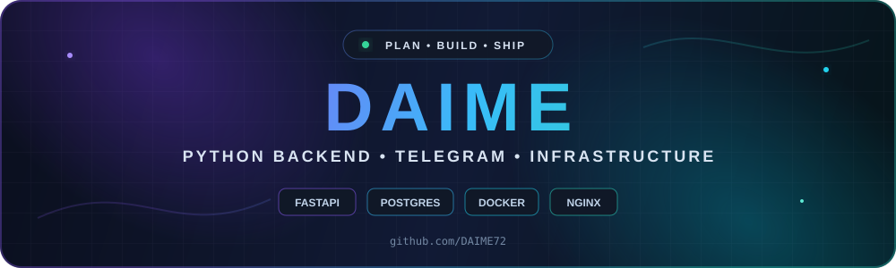

<p align="center">
  
</p>

<p align="center">
  <a href="https://github.com/DAIME72?tab=repositories"></a>
  
  
</p>

## About me

I build production-minded Python services: Telegram products, backend APIs, payment workflows and the infrastructure that keeps them running.

- I turn a business flow into a working service — from database schema and API integration to deployment.
- I care about validation, idempotency, logging, backups and predictable recovery.
- I work with Python, FastAPI, Aiogram, PostgreSQL/Supabase, Docker, Nginx and Linux.
- Computer science student at Peter the Great St. Petersburg Polytechnic University.

## Selected projects

<table>
  <tr>
    <td width="50%" valign="top">
      <h3>🛡️ Gift Guarant</h3>
      <p>Telegram escrow service for TON with per-deal addresses, on-chain payment verification, atomic state transitions and duplicate-payout protection.</p>
      <p><code>Python</code> <code>Aiogram</code> <code>FastAPI</code> <code>PostgreSQL</code> <code>TON API</code></p>
    </td>
    <td width="50%" valign="top">
      <h3>🔴 RedStoneVPN</h3>
      <p>Subscription and payment flow with temporary access, webhooks, server integrations, safe deployment, backups and localized connection pages.</p>
      <p><code>Python</code> <code>FastAPI</code> <code>Docker</code> <code>Nginx</code> <code>Linux</code></p>
    </td>
  </tr>
  <tr>
    <td width="50%" valign="top">
      <h3>🌍 Status Map</h3>
      <p>Responsive server-status visualization with a WebGL globe on desktop and a lightweight DOM renderer on mobile.</p>
      <p><code>JavaScript</code> <code>globe.gl</code> <code>HTML</code> <code>CSS</code> <code>i18n</code></p>
    </td>
    <td width="50%" valign="top">
      <h3>🎮 Esports Team Director</h3>
      <p>Windows utility with hotkey-based screen capture, structured recommendations, JSON history, a local HTTP server and an OBS browser overlay.</p>
      <p><code>Python</code> <code>Desktop</code> <code>HTTP</code> <code>OBS</code> <code>pytest</code></p>
    </td>
  </tr>
</table>

## Stack

<p align="center">
  
</p>

<p align="center">
  
  
  
  
</p>

## What I can build

```text
Telegram bots    → user flows, databases, subscriptions, payments, admin tools
Backend services → FastAPI, PostgreSQL, webhooks, integrations, background jobs
Automation       → Python scripts, Excel/VBA, reports, public-data processing
Deployment       → Docker, Nginx, HTTPS, Linux services, logs and backups
Web interfaces   → responsive HTML/CSS/JavaScript, localization, visualizations
```

## Engineering principles

```python
class HowIWork:
    clear_scope = True
    observable_services = True
    safe_state_changes = True
    test_before_deploy = True
    rollback_plan = True
```

<p align="center">
  <strong>Open to backend internships, project work and focused freelance tasks.</strong>
</p>

<p align="center">
  <sub>Building reliable things, one well-defined state transition at a time.</sub>
</p>
